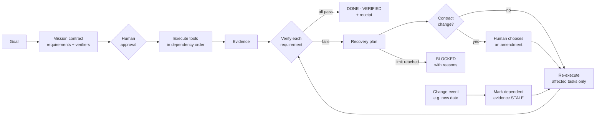

<div align="center">

# HADES

### Human-AI Driven Execution System

**Don't just ask AI. Give it a goal.**

HADES turns a goal into a contract, executes it with real tools, proves every requirement with evidence,<br>
and re-runs only what a change affects, with humans in control of every decision that matters.

[](https://hades-ai-execution-system-87hc.vercel.app/)


</div>

---

## Why HADES?

AI assistants are great at talking, but they struggle to get things done reliably:

- **"Done!" without proof.** A green tick usually means the AI *said* it succeeded, not that anything was checked.
- **Plans change, answers go stale.** When a date or budget changes midway, the AI can't tell which earlier results are now wrong.
- **Control is all or nothing.** Either the AI acts alone with no checkpoints, or the user has to babysit every step.

HADES is built around one rule: **the AI suggests, the engine checks, and the human decides.**

| | Chatbot | Typical AI agent | **HADES** |
|---|:---:|:---:|:---:|
| Takes actions with tools | ✗ | ✓ | ✓ |
| Agrees on what "done" means before starting | ✗ | ✗ | ✓ |
| Verifies results against evidence | ✗ | Partly | ✓ |
| Re-runs only what a change affects | ✗ | ✗ | ✓ |
| Asks before changing the deal | ✗ | ✗ | ✓ |
| Says BLOCKED honestly when it can't deliver | ✗ | Rarely | ✓ |

---

## How it works



1. **Compile.** The goal becomes a **mission contract**: typed requirements, parameters, and a named verifier for each requirement.
2. **Approve.** Nothing runs until the user approves the plan.
3. **Execute.** The tool router runs tasks in dependency order and records **evidence** for every task.
4. **Verify.** Each requirement is checked against its evidence by an independent verifier, which also explains its verdict.
5. **Adapt.** When an input changes, HADES marks only the dependent evidence as **stale** and re-runs only those tasks.
6. **Recover or block.** If a constraint can't be met, HADES proposes **contract amendments** for the user to choose from. Recovery is bounded, and if nothing works the mission ends **BLOCKED**, with the reasons.

---

## Demo walkthrough

Every screenshot below is from a real run on the [deployed app](https://hades-ai-execution-system-87hc.vercel.app/).

**Goal:**
> *Get me ready for my Bengaluru trip on Friday: build a packing list and keep total cost under ₹4,000*

### 1. Goal → contract → approval

HADES compiles the goal into two requirements, each with its own verifier (`verify_packing_list`, `verify_budget`), and waits for approval.


### 2. Every requirement proven

After execution, the mission ends **DONE · VERIFIED (2/2)**. Each verifier explains its verdict:

- *Packing list:* 9 items, consistent with an 89% chance of rain (includes Raincoat, Umbrella)
- *Budget:* total ₹3,600 (Friday train ₹2,600 + local ₹1,000) is within the ₹4,000 limit


### 3. "Trip moved to Sunday": targeted re-execution

HADES updates `trip_date` and re-executes **only 4 of 7 tasks** (`fetch_weather`, `build_packing_list`, `fetch_fares`, `compute_budget`). The other 3 stay valid.


### 4. Contract amendment: the human decides

Sunday fares push the total to ₹4,600, so the budget check fails. Instead of quietly overspending, HADES offers two amendments with the exact change shown:

| Option | Change | Result |
|---|---|---|
| Raise budget | `max_budget: ₹4,000 → ₹4,600` | Keep the train |
| **Overnight sleeper bus** ✓ | `travel_mode: train → bus` | ₹3,200, within limit |

After the bus is chosen, **only 2 of 7 tasks re-run**, and the mission re-verifies 2/2.


### 5. Reliable without depending on an LLM

The whole demo run used **0 LLM calls** (planning, execution, recovery, and verification). The core engine is deterministic and local-first, and Gemini and Groq are optional enhancements.


---

## Features

| Feature | Description |
|---|---|
| 📜 **Mission contract** | Goals compiled into typed requirements, parameters, and verifiers |
| ✅ **Independent verifiers** | Requirements checked against recorded evidence, never the tool's own success flag |
| 🕸️ **Dependency graph** | Requirement → tasks → evidence, with stale propagation when inputs change |
| 🔄 **Targeted re-execution** | Only tasks whose inputs changed are re-run |
| 🤝 **Contract amendments** | Before → after diffs, with human consent required to change the deal |
| 🙋 **Human-in-the-loop** | Approval before execution and on every contract change |
| 🚫 **Honest BLOCKED state** | Bounded recovery with loop protection; reports what failed and why |
| 🔐 **Audit trail** | SHA-256 hash-chained event stream and a downloadable mission receipt |
| 🗂️ **Mission history** | Reopen past missions with their evidence and audit timeline |
| 🧠 **LLM-optional** | Deterministic core; Gemini and Groq as optional add-ons, with live call counters |

---

## Tech stack

| Layer | Technology |
|---|---|
| Backend | Python, FastAPI |
| Frontend | React, Vite |
| Tools | Open-Meteo (read-only weather), local packing, fare, and budget tools |
| AI (optional) | Gemini, Groq |
| Deployment | Vercel |

---

## Getting started

### Prerequisites

- Python 3.10+
- Node.js 18+

### 1. Clone

```bash
git clone https://github.com/<your-username>/<your-repo>.git
cd <your-repo>
```

### 2. Backend

```bash
cd backend                      # adjust to your backend folder name
python -m venv .venv
source .venv/bin/activate       # Windows: .venv\Scripts\activate
pip install -r requirements.txt
cp .env.example .env            # optional: add GEMINI_API_KEY / GROQ_API_KEY
uvicorn main:app --reload --port 8000
```

### 3. Frontend

```bash
cd frontend
npm install
cp .env.example .env            # set VITE_API_URL=http://localhost:8000
npm run dev
```

Open http://localhost:5173 and try the sample goal above.

> **API keys are optional.** HADES runs fully without Gemini or Groq. Keys only enable the optional AI enhancements. Never commit your `.env` file.

---

## Roadmap

- [ ] More tools through open connector standards such as MCP (calendar, email, files)
- [ ] Risk-tiered actions: read-only, reversible, and irreversible (always needs approval)
- [ ] A larger verifier library, with tools that have no verifier shown as "unverified", never green
- [ ] Actor attribution: tag every event as AI, Engine, or Human in the receipt

---


<div align="center">

**Chatbots answer prompts. HADES executes goals.**

[Live Demo](https://hades-ai-execution-system-87hc.vercel.app/) · [Demo Video](VIDEO_LINK)

</div>
